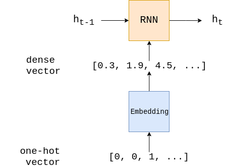

task1：情感分析baseline
===
[toc]

# 相关包的安装
## 第一步，安装spacy
因为教学的文档直接是使用spacy安装相应的en_core_web_sm模块，我这边因为没有安装相应的包，所以就先安装spacy
```
pip install spacy

```

然后下载数据集,注意不要开vpn，我这边使用的阿里的镜像，开vpn速度反而慢
```
python -m spacy download en_core_web_sm

```

# 数据预处理
```python
import torch
from torchtext.legacy import data

# 设置随机种子数，该数可以保证随机数是可重复的
SEED = 1234

# 设置种子
torch.manual_seed(SEED)
torch.backends.cudnn.deterministic = True

# 读取数据和标签
TEXT = data.Field(tokenize = 'spacy', tokenizer_language = 'en_core_web_sm')
LABEL = data.LabelField(dtype = torch.float)

```


```python
# 下载数据集
from torchtext.legacy import datasets

train_data, test_data = datasets.IMDB.splits(TEXT, LABEL)

# 数据集下载的太慢了.....
```


```python
# 查看训练集和测试集的大小
print(f'Number of training examples: {len(train_data)}')
print(f'Number of testing examples: {len(test_data)}')

# 看一下示例数据
print(vars(train_data.examples[0]))


# 设置训练集与验证集的比例
import random

train_data, valid_data = train_data.split(split_ratio=0.8 , random_state = random.seed(SEED))


# 此时的训练集，验证集，测试集
print(f'Number of training examples: {len(train_data)}')
print(f'Number of validation examples: {len(valid_data)}')
print(f'Number of testing examples: {len(test_data)}')

```

我们训练集中不同的单词数超过100,000，这意味着我们的one-hot向量超过100,000维，这将大大延长训练时间，甚至不适合在本地运行。

有两种方法可以优化我们的one-hot向量，一种是可以只取前n个出现次数最多的单词作为one-hot的基，另一种是忽略出现次数小于m个的单词。 在本例中，我们使用第一种方法：使用25,000个最常见的单词作为one-hot编码。

这样就会出现一个问题：有些单词在数据集中出现了，但却无法直接进行one-hot编码。这里我们使用一个特别的<unk>来编码它们。举个例子，如果我们的句子是"This film is great and I love it"，但是单词"love"不在词汇表中，那么我们将这句话转换成："This film is great and I <unk> it"。

下面我们构建词汇表，只保留最常见的 max_size 标记。
```python

MAX_VOCAB_SIZE = 25000

TEXT.build_vocab(train_data, max_size = MAX_VOCAB_SIZE)
LABEL.build_vocab(train_data)

print(f"Unique tokens in TEXT vocabulary: {len(TEXT.vocab)}")
print(f"Unique tokens in LABEL vocabulary: {len(LABEL.vocab)}")

```
为什么只在训练集上建立词汇表？因为在测试模型时，都不能以任何方式影响测试集。 当然也不包括验证集，因为希望验证集尽可能地反映测试集。

为什么词典大小是25002而不是25000?另外两个额外的token是 <unk>和<pad>.

```python
# 我们还可以查看词汇表中最常见的单词及其他们在数据集中出现的次数。
print(TEXT.vocab.freqs.most_common(20))

# 也可以使用 stoi (string to int) or itos (int to string) 方法，以下输出text-vocab的前10个词汇。
print(TEXT.vocab.itos[:10])


```

准备数据的最后一步是创建迭代器. 需要创建验证集，测试集，以及训练集的迭代器, 每一次的迭代都会返回一个batch的数据。

我们将使用一个“BucketIterator”，它是一种特殊类型的迭代器，它将返回一批示例，其中每个样本的长度差不多，从而最小化每个样本的padding数。

如何有gpu的话，当然可以将迭代器返回的张量放在GPU上.可以用torch.device，可以将张量放到gpu或者cpu上。

```python
BATCH_SIZE = 64

device = torch.device('cuda' if torch.cuda.is_available() else 'cpu')

train_iterator, valid_iterator, test_iterator = data.BucketIterator.splits(
    (train_data, valid_data, test_data), 
    batch_size = BATCH_SIZE,
    device = device)


```


# 构建模型
在 PyTorch 中使用RNN的模型的时候，创建RNN的时候不是使用RNN类，而是nn.module的子类。



在每一个batch中, text,是一个大小为 _[sentence length, batch size]_的tensor. 这都是每一个句子对应的one-hot向量转换得到的。

而每个句子的one-hot向量都是由对应词典生成索引，然后根据索引值就可以得到每个句子的one-hot向量表示方式。

每一个输入的batch经过embedding层都会被embedded, 得到每一个句子的密集向量表示. embedded后的向量size为 [sentence length, batch size, embedding dim].

在某些框架中，使用RNN需要初始化 ℎ0 ，但在pytorch中不用，默认为全0。 使用 RNN 会返回 2个tensors, output和hidden。 output的size为[sentence length, batch size, hidden dim] and hidden的size为[1, batch size, hidden dim]. output 为每一层的隐藏层状态, 而 hidden 是最后一层的隐藏层状态. 小记： squeeze 方法, 可以消除维度为1的维度。

其实我们一般用hidden就行了,不用管output 。最终，通过线性层 fc, 产生最终的预测。

```python

import torch.nn as nn

class RNN(nn.Module):
    def __init__(self, input_dim, embedding_dim, hidden_dim, output_dim):
        
        super().__init__()
        
        self.embedding = nn.Embedding(input_dim, embedding_dim)
        
        self.rnn = nn.RNN(embedding_dim, hidden_dim)
        
        self.fc = nn.Linear(hidden_dim, output_dim)
        
    def forward(self, text):

        #text = [sent len, batch size]
        
        embedded = self.embedding(text)
        
        #embedded = [sent len, batch size, emb dim]
        
        output, hidden = self.rnn(embedded)
        
        #output = [sent len, batch size, hid dim]
        #hidden = [1, batch size, hid dim]
        
        assert torch.equal(output[-1,:,:], hidden.squeeze(0))
        
        return self.fc(hidden.squeeze(0))

```
下面，我们可以做建立一个RNN的例子

输入维度就是对应one-hot向量的维度, 也等同于词典的维度.

embedding 维度是可以设置的超参数. 通常设置为 50-250 维度, 某种程度上也和词典大小有关.

隐藏层维度就是最后一层隐藏层的大小. 通常可以设置为100-500维, 这个也会词典大小，任务的复杂程度都有关系

输出的维度就是要分类的类别的数目。

```python

INPUT_DIM = len(TEXT.vocab)
EMBEDDING_DIM = 100
HIDDEN_DIM = 256
OUTPUT_DIM = 1

model = RNN(INPUT_DIM, EMBEDDING_DIM, HIDDEN_DIM, OUTPUT_DIM)

#也可以输出要训练的参数数目看看.
def count_parameters(model):
    return sum(p.numel() for p in model.parameters() if p.requires_grad)

print(f'The model has {count_parameters(model):,} trainable parameters')

```


# 训练模型
在模型训练前，先要设置优化器，这里我们选择的是SGD，随机梯度下降计算，model.parameters()表示需要更新的参数，lr为学习率

```python

import torch.optim as optim

optimizer = optim.SGD(model.parameters(), lr=1e-3)


# 定义损失函数
criterion = nn.BCEWithLogitsLoss()


# 如果存在gpu，可以放到gpu上运行
model = model.to(device)
criterion = criterion.to(device)

```

损失函数用来计算损失值，还需要计算准确率的函数。

将sigmoid层输出的预测结果输入到计算准确率的函数, 取整到最近的整数.大于0.5，就取1。反之取0。

计算出预测的结果和label一致的值，在除以所有的值，就可以得到准确率。

```python
def binary_accuracy(preds, y):
    """
    Returns accuracy per batch, i.e. if you get 8/10 right, this returns 0.8, NOT 8
    """

    #round predictions to the closest integer
    rounded_preds = torch.round(torch.sigmoid(preds))
    correct = (rounded_preds == y).float() #convert into float for division 
    acc = correct.sum() / len(correct)
    return acc


```

train 函数迭代所有的样本，每次都是一个batch。

model.train() 将model处于 "training 模式", 也会打开 dropout 和 batch normalization. 在每一次的batch, 先将梯度清0. 模型的每一个参数都有一个 grad 属性， 存储着损失函数计算的梯度值. PyTorch 不会自动删除（或“归零”）从上次梯度计算中计算出的梯度，因此必须手动将其归零。

每次输入, batch.text, 到模型中. 只需要调用模型即可.

用loss.backward()计算梯度，更新参数使用的是 optimizer.step()。

损失值和准确率在整个 epoch 中累积, .item()抽取张量中只含有一个值的张量中的值。

最后，我们返回损失和准确率，在整个 epoch 中取平均值. len可以得到epoch中的batch数

当然在计算的时候，要记得将LongTensor转化为 torch.float。这是因为 TorchText 默认将张量设置为 LongTensor。

```python

# 训练函数
def train(model, iterator, optimizer, criterion):
    
    epoch_loss = 0
    epoch_acc = 0
    
    model.train()
    
    for batch in iterator:
        
        optimizer.zero_grad()
                
        predictions = model(batch.text).squeeze(1)
        
        loss = criterion(predictions, batch.label)
        
        acc = binary_accuracy(predictions, batch.label)
        
        loss.backward()
        
        optimizer.step()
        
        epoch_loss += loss.item()
        epoch_acc += acc.item()
        
    return epoch_loss / len(iterator), epoch_acc / len(iterator)

# 评估函数
def evaluate(model, iterator, criterion):
    
    epoch_loss = 0
    epoch_acc = 0
    
    model.eval()
    
    with torch.no_grad():
    
        for batch in iterator:

            predictions = model(batch.text).squeeze(1)
            
            loss = criterion(predictions, batch.label)
            
            acc = binary_accuracy(predictions, batch.label)

            epoch_loss += loss.item()
            epoch_acc += acc.item()
        
    return epoch_loss / len(iterator), epoch_acc / len(iterator)

# 计时函数
import time

def epoch_time(start_time, end_time):
    elapsed_time = end_time - start_time
    elapsed_mins = int(elapsed_time / 60)
    elapsed_secs = int(elapsed_time - (elapsed_mins * 60))
    return elapsed_mins, elapsed_secs

```


```python
# 开始训练

N_EPOCHS = 5

best_valid_loss = float('inf')

for epoch in range(N_EPOCHS):

    start_time = time.time()
    
    train_loss, train_acc = train(model, train_iterator, optimizer, criterion)
    valid_loss, valid_acc = evaluate(model, valid_iterator, criterion)
    
    end_time = time.time()

    epoch_mins, epoch_secs = epoch_time(start_time, end_time)
    
    if valid_loss < best_valid_loss:
        best_valid_loss = valid_loss
        torch.save(model.state_dict(), 'tut1-model.pt')
    
    print(f'Epoch: {epoch+1:02} | Epoch Time: {epoch_mins}m {epoch_secs}s')
    print(f'\tTrain Loss: {train_loss:.3f} | Train Acc: {train_acc*100:.2f}%')
    print(f'\t Val. Loss: {valid_loss:.3f} |  Val. Acc: {valid_acc*100:.2f}%')


```


